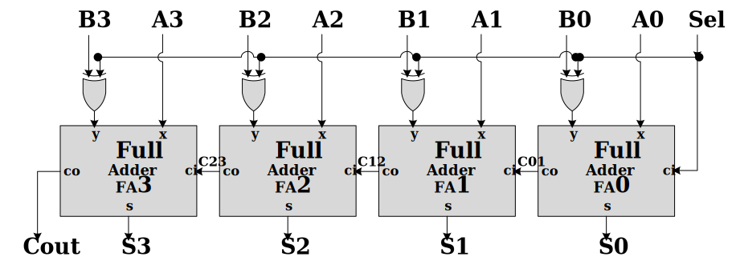
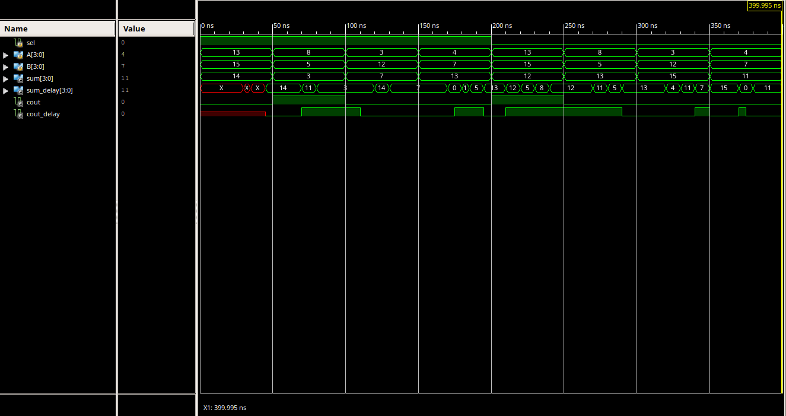

### Goals

- How describle full adder in gate level?
- How design adder-subtractor by bit scale design
- Structural implementation in Verilog

### Pre-Report
* Write verilog code for full adder in gate level.
* Write verilog code for signle bit adder/subtractor in gate level.

* Write verilog code for 4-bit adder/subtractor using 1-bit adder/subtractor.

### Grading Sources

* Write verilog code for full adder of pre-report section (`full_adder.v`).
* Write verilog code for 1-bit asser/subtractor of pre-report section (`addsub.v`).
* Synthesis 1-bit adder/subtractor without any error and warning.
* Save RTL Schematic of 1-bit adder/subtractor as a file and check its correctness.
* Design 4 bits adder/subtractor using 1-bit adder/subtractor and write verilog code of it (`adder_subtractor_4bit.v`).
* Complete testbench file of 4 bit adder/subtractor for validate the correctness of modules (`tb_adder_subtractor_4bit.v`).
* Synthesis 4 bit adder/subtractor without any error and warning.
* Write verilog code for full adder with delay (`full_adder_delay.v`)

| NOT | AND2 | NAND2 | OR2 | NOR2 | XOR2 | AND3 | OR3 |
|-----|------|-------|-----|------|------|------|-----| 
| 2ns | 5ns  |  5ns  | 5ns |  5ns | 10ns | 5ns  | 5ns |
 
* Write verilog code for deleyed version of adder subtractor  using deleyed full adder (`add_sub_deley.v`)
* Write verilog code for deleyed version of 4 bit adder/subtractor  using deleyed adder/subtractor (`adder_subtractor_4bit_deley.v`)
* Complete testbench file of 4 bit adder/subtractor for validate the correctness of modules (`tb_adder_subtractor_4bit.v`).
* Report 4 bit adder maximum delay according to delay table.

| NOT | AND2 | NAND2 | OR2 | NOR2 | XOR2 | AND3 | OR3 |
|-----|------|-------|-----|------|------|------|-----| 
| 2ns | 5ns  |  5ns  | 5ns |  5ns | 10ns | 5ns  | 5ns |

### Result

